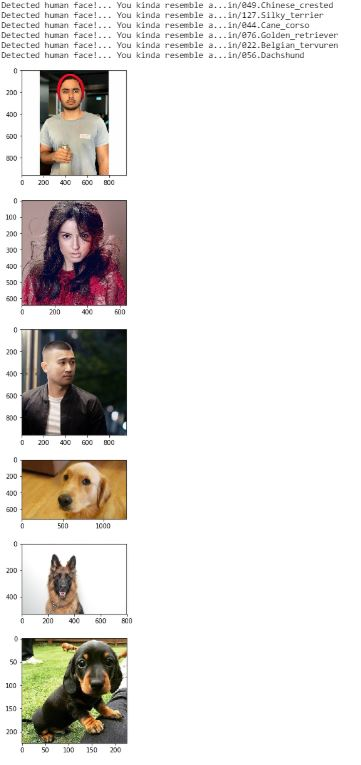

# Dog App Project.
This project was geared toward creating a dog app that can approximate what kind of dog the user resemble. 

Pre-requisites
--------------
* Numpy
* Keras
* CV2
* Matplotlib
* Imageio
* SkLearn
* PIL
## Model Creation
The model I used to predict the dog images, was a pretrained Resnet network.

Using a **pretrained** network allows one to take advantage of having a trained network to do all the heavy lifting, and all I have to do is add my dataset classification at the end of the network.

# Results
The model seems to run well, and was very interesting project in developing an complete understanding of convnets, and pretrained networks.

